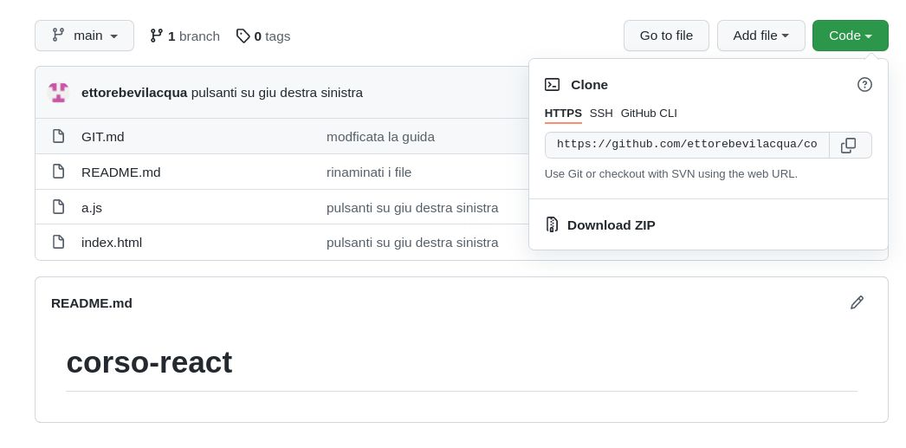

# Clonare un progetto

### **Prepare il proprio pc:**

* Creare una cartella corso dove inserire i progetti svolti (o aprirla).

* premere ctrl-l per far apparire l'indirizzo della propria cartella.
  
 

* Aprire il terminale di sistema che si può trovare cercando cmd dal menu avvio.

* e scrivere cd e incolla del indirizzo della cartella:  
`cd path_mio_progetto` 

mi trovo quindi nel terminale dentro la cartella di tutti i progetti del corso, il clone ci crea una cartella con il nome del progetto.

### **Clonare un repository **

* Andiamo sul link del progetto su github, e click sul pulsante verde in alto a destra "CODE"

  

* ci appare il link del repository
un piccolo trucco per evitare questo passaggio è che se ho un link come questo  https://github.com/ettorebevilacqua/corso-react/blob/main/README.md lo riscrivo prendendo il nome utente e il nome del progetto con finale .git , eliminando gli altri percorsi cosi :  https://github.com/ettorebevilacqua/corso-react.git

* Se ci siamo posizionati sulla console sulla cartella dove si trovano i vari progetti
  
git clone https://github.com/ettorebevilacqua/corso-react.git

questo comando ci crea una cartella corso-react (se già esistente rinominare la vecchia) con dentro il nostro progetto

a questo punto possiamo spostarci dentro la cartella corso-react con dentro il progettocon il commando  :

`cd corso-react`

ATTENZIONE A VISUAL STUDIO CODE

Un progetto di visual studio code o simili, è una cartella,
per evitare malfunzionamenti o tipicamente che git non funziona su una cartella superiore, APRIRE IL PROGETTO NELLA CARTELLA GIUSTA, in questo caso corso-react, e NON LA CARTELLA SUPERIORE DOVE SI TROVA.

mi dovrei trovare le cartelle di questo tipo

-corso
  - |  corso-react
  - |  Asteroid
  - |  esempio

Ripeto : aprire la cartella dentro a corso, non corso.

per vedere se tutto è ok, proviamo :

`git pull origin main` 